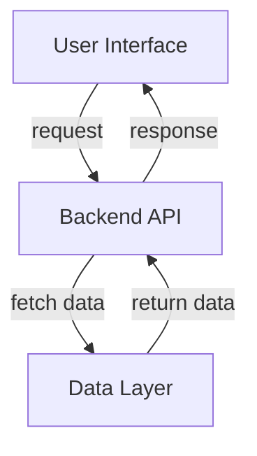
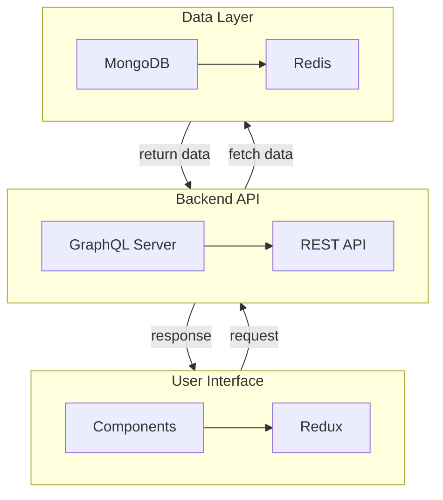

# Architecture Overview

## 1. System Components

### 1.1 User Interface
- **Description**: Web-based application that allows users to interact with the Polymarket platform. Visualizes market data in real-time.
- **Key Technologies**: React, Redux, CSS, WebSockets.

### 1.2 Backend API
- **Description**: Serves as the communication layer between user interface and data sources, handling user requests, and processing trades.
- **Key Technologies**: Node.js, Express, MongoDB, GraphQL.

### 1.3 Data Layer
- **Description**: Manages database connections and performs CRUD operations. Holds all market, user and transaction data.
- **Key Technologies**: MongoDB, Redis.

## 2. Data Flow

## 3. Key Features
- **Real-time data updates**: Users receive live updates on market movements.
- **User authentication**: Secure login via OAuth.
- **Market creation**: Users can create new markets for trading.

## 4. Technology Stack
- **Frontend**: React, Redux, CSS.
- **Backend**: Node.js, Express, GraphQL.
- **Database**: MongoDB, Redis.

## 5. Enhanced Mermaid Diagram with Subgraphs

## 6. Conclusion
This Architecture outlines the critical components, data flow, and technology stack for the Polymarket bot, ensuring a clear understanding of the system's functioning and structure.