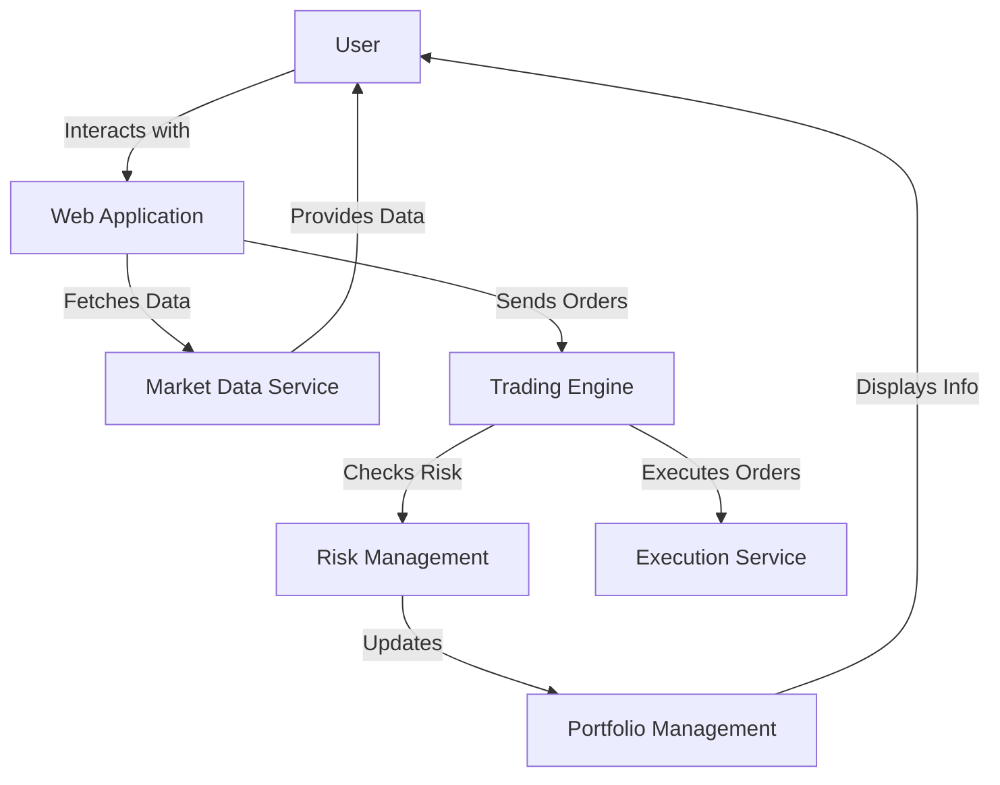

# ARCHITECTURE.md

## 1. System Overview

## 2. Core Components
- **Market Data Service**: Responsible for collecting and providing market data.
- **Trading Engine**: Handles order processing, matching, and execution.
- **Risk Management**: Monitors and manages trading risks.
- **Portfolio Management**: Tracks user portfolios and manages positions.
- **Execution Service**: Executes trades on the target platforms.

## 3. Data Flow Diagram

- The system receives user inputs from the web application.
- The Market Data Service gathers data and sends it to the Trading Engine.
- Orders are processed and executed through the Execution Service.

## 4. Deployment Architecture
- **Docker**: Containerization for all services.
- **Kubernetes**: Orchestrates the deployment and scaling of containerized applications.
- **AWS Services**: Utilizes EC2 for compute, S3 for storage, and RDS for database management.

## 5. API Specifications
- `GET /markets`: Retrieve market data.
- `POST /orders`: Place a new order.
- `GET /portfolio`: Retrieve user portfolio.
- `GET /trades`: Retrieve trade history.

## 6. Database Schema
### Markets
- `market_id`: Integer, primary key
- `market_name`: String
- `current_price`: Decimal

### Positions
- `position_id`: Integer, primary key
- `user_id`: Integer
- `market_id`: Integer
- `quantity`: Decimal

### Trades
- `trade_id`: Integer, primary key
- `user_id`: Integer
- `market_id`: Integer
- `trade_price`: Decimal
- `trade_time`: Timestamp

### Users
- `user_id`: Integer, primary key
- `username`: String
- `password_hash`: String

## 7. Security Architecture
- **Authentication**: JWT tokens for user sessions.
- **Encryption**: TLS for data in transit, AES for sensitive data at rest.
- **Rate Limiting**: API rate limiting to prevent abuse.

## 8. Scalability Patterns
- **Caching**: Utilize Redis for caching market data.
- **Message Queues**: RabbitMQ for async order processing.
- **Load Balancing**: Distribute incoming traffic across multiple instances.

## 9. Monitoring and Logging Architecture
- Implement logging for all services using ELK stack (Elasticsearch, Logstash, Kibana).
- Monitor system health and performance with Prometheus and Grafana.

## 10. Technology Stack Recommendations
- **Frontend**: React.js for the user interface.
- **Backend**: Node.js with Express.
- **Database**: PostgreSQL for relational data.
- **Containerization**: Docker for development environments.
- **Orchestration**: Kubernetes for deployment and scaling.