# Architecture of Polymarket Trading Bot

## System Overview

```mermaid
graph TD
    A["🔗 Polymarket API"] -->|Market Data| B["📊 Market Analysis"]
    A -->|Trade Execution| C["⚡ Order Execution"]
    B -->|Market Trends| D["📈 Position Management"]
    D -->|Manage Positions| C
    E["🛡️ Risk Management"] -->|Risk Parameters| D
    D -->|Position Info| E
    F["📡 Monitoring Systems"] -->|Alerts| B
    F -->|Trade Monitoring| C
    G[("💾 Database")] -->|Store Data| B
    G -->|Store Positions| D
    G -->|Store Trades| C
    H["🌐 External Services"] -->|Fetch Data| B
    H -->|Alert Services| F
```

## Components:

### Core Services
- **Market Analysis**: Analyzes market data and trends to identify trading opportunities
- **Position Management**: Tracks and manages all open positions with entry/exit rules
- **Risk Management**: Enforces risk limits and validates trades before execution
- **Order Execution**: Places and executes trades with the Polymarket API

### Infrastructure
- **Monitoring Systems**: Real-time alerts and system health monitoring
- **Database**: Persistent storage for market data, positions, and trading history
- **External Services**: Additional data sources and notification services

### Integration Points
- **Polymarket API**: Primary exchange for market data and order execution